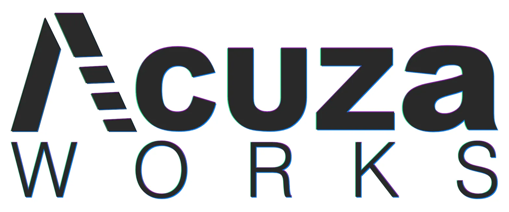
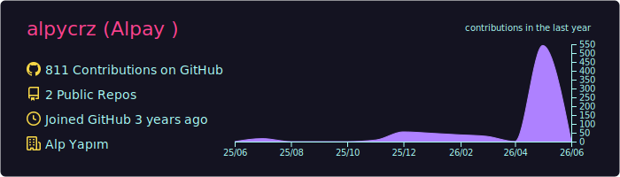
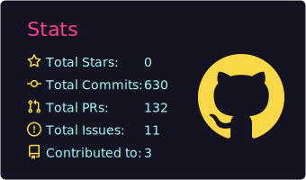
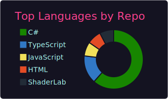
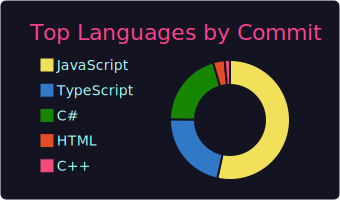
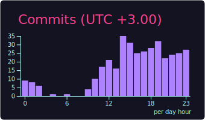

<!-- ============================================== -->
<!--   ALPAY  •  README                             -->
<!--   "Not for everyone."                          -->
<!-- ============================================== -->

<div align="center">


<a href="https://github.com/alpycrz">
  
</a>

<br/><br/>

[](https://www.linkedin.com/in/alpay-kucuk/)
[](https://x.com/alpycrz)
[](https://discord.gg/HWceHH9NBn)
[](https://www.instagram.com/alpycrz/)
[](https://bsky.app/profile/alpycrz.bsky.social)
[](https://medium.com/@alpaykucuk08)
[](https://www.reddit.com/user/alpycrz/)

</div>

---

## 🜏 &nbsp; INITIATE

```ts
const alpay = {
  location: "Istanbul, Türkiye 🇹🇷",
  role: "Indie Game Developer & Creative Director",
  studio: "ACUZA WORKS — founder",
  craft: ["Game Design", "Virtual Production", "Creative Direction"],
  engines: ["Unity (primary)", "Unreal Engine"],
  currentlyLearning: ["JavaScript", "Full-stack Web"],
  philosophy: "Not for everyone.",
};
```

> _I don't build games to be popular. I build them so that the right people never forget._

---

## ▌ &nbsp; ACUZA WORKS

<div align="center">
  
  <br/><br/>
  <em>An independent game studio crafting dark, deliberate experiences.</em>
  <br/><br/>
</div>

In a market drowning in safe, sanitized content, **ACUZA** exists as a deliberate objection. We make games that challenge, disturb, and stay with the player long after the credits roll.

🜲 &nbsp;_Built in Istanbul. For those who seek the unforgettable._

---

## ⚔ &nbsp; NOW IN DEVELOPMENT

<div align="center">

### ⛓ &nbsp; Menos Pheron: Chains


&nbsp;

&nbsp;


<br/><br/>

<b>Mythological action roguelite</b>

<p>A top-down spin-off of the <em>Menos Pheron</em> universe.<br/>
Built around the <b>Kibir</b> mechanic and the <b>Titan Zinciri</b> active skill.</p>

</div>

---

## 🗄 &nbsp; THE ARCHIVE

<sub>Past ACUZA prototypes — currently on hold, not abandoned. The right ones will return.</sub>

| Project | Type | Engine | Status |
|---|---|---|:--:|
| 🃏 &nbsp;**Hellbound** | Dark fantasy card game | Unity / C# | `on hold` |
| 🟦 &nbsp;**NeonRix** | Roguelike × Tetris hybrid | Unity | `on hold` |
| 🏰 &nbsp;**Core Doctrine** | Anti-hero tower defense roguelike | Unity 6.3 | `on hold` |
| 🗡 &nbsp;**Blade Stand** | Roguelite idle action | Unity / Mobile | `on hold` |

---

## ⚙ &nbsp; ARSENAL

<details open>
<summary><b>&nbsp;Game Development</b></summary>
<br/>


</details>

<details open>
<summary><b>&nbsp;Code & Tooling</b></summary>
<br/>


</details>

<details>
<summary><b>&nbsp;Creative Suite</b></summary>
<br/>


</details>

<details>
<summary><b>&nbsp;AI Toolkit</b></summary>
<br/>


</details>

---

## 📊 &nbsp; SIGNAL

<!-- Bu görseller GitHub Action ile alpycrz/alpycrz reposunda üretiliyor -->

<div align="center">



<br/><br/>




<br/><br/>


<br/><br/>


</div>

---

## ⌨ &nbsp; MOST PUSHED

<sub>Commit bazında en çok dokunduğum diller.</sub>

<div align="center">




</div>

---

## 🜂 &nbsp; CURRENTLY

```diff
+ Building   →  Menos Pheron: Chains (mythological action roguelite, PC + Android)
+ Learning   →  JavaScript & full-stack development
+ Sharpening →  Virtual Production workflows
+ Reading    →  Indie dev post-mortems
! Vibe       →  Dark, deliberate, unforgettable
```

---

<div align="center">

### ⛧

> _Games that refuse to be forgotten._

<br/>


<br/><br/>


</div>
